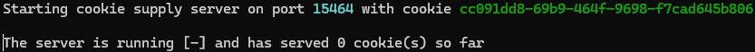

# Chat with RTX API
## Getting started
Just run `ChatRTX_Runner.py` to start up the background process. (This can take a while, min. is usually around 30 sec)

While it is starting up, a browser webpage may flash on the screen. This is normal, and is happening because Chat with RTX opens a webpage by default, but it is suppressed by this program.

You will know when it is fully running when you see something like this:

## Usage

Within your script, use `import ChatRTX_API`. When this line of code is run, a pause of up to 60 seconds may occur (unless `ChatRTX_Runner.py` isn't running, where it will just crash after 60 seconds). After this wait, the import is now ready to serve ai requests.

### Start a request

To start a request to the AI, run `ChatRTX_API.send_msg("msg")` with the message you want to ask it. This will return a thread object (a promise of sorts), that should be passed to `ChatRTX_API.read_status(obj)` to get data back on the request.

### Receive data

To receive data on a request, run `ChatRTX_API.read_status(obj)`, with obj being the object returned by send_msg. This function returns a tuple, (status, data), if something new has happened, otherwise, it returns None. Status can be in one of three states, which define what data contains:

- `status`: data contains status message. This return can be ignored if the status isn't needed for printing or logging.
- `error`: data contains an error message. Obj can be discarded.
- `response`:  data contains the AI's response. Obj can be discarded.